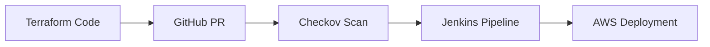

## 🧠 Why I Chose Terraform

Coming from a project management and academic background, I wanted to *actually build things* — infrastructure included. I chose Terraform because:

- **Declarative Syntax**: Write what you want, not how to get there  
- **Multi-Cloud Ready**: Works with AWS, Azure, GCP and more  
- **DevSecOps Integration**: Fits perfectly in CI/CD pipelines  
- **Community Support**: 1,000+ providers and modules available  

---

## 🛠️ Core Concepts I Learned

### 1. Infrastructure as Code Fundamentals
- **Providers**: The `aws` provider connects Terraform to AWS API  
- **Resources**: Building blocks like `aws_instance`, `aws_vpc`  
- **State Management**: The critical `.tfstate` file  
- **Plan/Apply Cycle**: `terraform plan` → review → `terraform apply`  

---

### 2. AWS Networking Basics

```hcl
# Network Foundation
resource "aws_vpc" "main" {
  cidr_block = "10.0.0.0/16"

  tags = {
    Name = "Terraform-VPC"
  }
}
```

---

## 🔧 EC2 Deployment Walkthrough

### Step 1: Configure AWS Provider

```hcl
provider "aws" {
  region = "eu-central-1"

  # Never hardcode credentials!
  # Use environment variables or AWS CLI config
}
```

---

### Step 2: Create Security Group

```hcl
resource "aws_security_group" "allow_ssh" {
  name        = "allow_ssh"
  description = "Allow SSH inbound traffic"
  vpc_id      = aws_vpc.main.id

  ingress {
    description = "SSH from anywhere"
    from_port   = 22
    to_port     = 22
    protocol    = "tcp"
    cidr_blocks = ["0.0.0.0/0"] # Restrict this in production!
  }

  egress {
    from_port   = 0
    to_port     = 0
    protocol    = "-1"
    cidr_blocks = ["0.0.0.0/0"]
  }
}
```

---

### Step 3: Launch EC2 Instance

```hcl
resource "aws_instance" "web" {
  ami           = "ami-0c55b159cbfafe1f0" # Amazon Linux 2
  instance_type = "t2.micro"
  key_name      = "terraform-key"
  vpc_security_group_ids = [aws_security_group.allow_ssh.id]

  tags = {
    Name = "Terraform-EC2"
  }
}
```

---

## 🚧 Challenges & Solutions

| Challenge         | Symptom                      | Root Cause                | Solution                        |
|------------------|------------------------------|---------------------------|----------------------------------|
| SSH Timeout       | Connection refused           | Missing Internet Gateway  | Added IGW and route table        |
| State File Lost   | "Resource doesn't exist"     | Accidental deletion       | Configured S3 backend            |
| Cost Surprise     | Unexpected AWS charges       | Left instances running    | Added `terraform destroy` step  |

---

## 🔒 Security Lessons

1. **Secrets Management**  
   - Never commit `.tfvars` files with credentials  
   - Use AWS Secrets Manager or environment variables  

2. **Least Privilege**  
   ```hcl
   # Bad
   cidr_blocks = ["0.0.0.0/0"]

   # Good
   cidr_blocks = ["203.0.113.12/32"] # Your IP only
   ```

3. **State Protection**  
   - Enable S3 bucket versioning  
   - Use DynamoDB for state locking  

---

## ✅ What's Next

1. **Advanced Terraform**
   - Modules for reusability  
   - Workspaces for environments  
   - Sentinel policies for governance  

2. **DevSecOps Integration**



---

## 🔗 Resources

- [Code Repository](https://github.com/devyogi7579/tf-infra-ec2)  
- [Official Terraform Docs](https://developer.hashicorp.com/terraform)  
- [AWS Free Tier](https://aws.amazon.com/free)  

---


*Thanks for reading. May your pipelines be green, your infra be tagged, and your security posture be strong!*

🔗 Explore my other blogs at [opsbygandal.dev](https://www.opsbygandal.dev)  
📁 Check out the GitHub repo [https://github.com/gandalops/portfolio-chirpy]  
🔄 Let’s connect on [LinkedIn](https://www.linkedin.com/)

---
